# Monster Sprite Assignments

## Summary

| Sheet | Grid | Total | Used | Unused |
|-------|------|-------|------|--------|
| Aquatic1 | 8x6 | 48 | 3 | 45 |
| Avian1 | 8x13 | 104 | 3 | 101 |
| Cat1 | 8x5 | 40 | 1 | 39 |
| Compendium | 30x18 | 540 | 10 | 530 |
| Demon1 | 8x9 | 72 | 6 | 66 |
| Dog1 | 8x7 | 56 | 2 | 54 |
| Elemental1 | 8x11 | 88 | 5 | 83 |
| Humanoid1 | 8x27 | 216 | 18 | 198 |
| Misc1 | 8x8 | 64 | 4 | 60 |
| Pest1 | 8x11 | 88 | 2 | 86 |
| Plant1 | 8x8 | 64 | 3 | 61 |
| Quadraped1 | 8x12 | 96 | 2 | 94 |
| Reptile1 | 8x15 | 120 | 11 | 109 |
| RogueLike1 | 8x9 | 72 | 14 | 58 |
| Slime1 | 8x5 | 40 | 6 | 34 |
| Undead1 | 8x10 | 80 | 17 | 63 |

## Assigned Monster Sprites

| Monster | Sheet | Col,Row |
|---------|-------|---------|
| ANCIENT | Humanoid1 | 1,10 |
| ARCHLICH | RogueLike1 | 4,6 |
| Ancient Dragon | Reptile1 | 0,3 |
| Balrog | Demon1 | 6,2 |
| Basilisk | RogueLike1 | 6,8 |
| Bat | RogueLike1 | 4,4 |
| Beholder | Elemental1 | 2,5 |
| Black Pudding | Slime1 | 2,1 |
| Bugbear | Humanoid1 | 6,4 |
| Bulette | Reptile1 | 0,11 |
| CURSED DEATH KNIGHT | Undead1 | 0,3 |
| Carrion Crawler | Pest1 | 0,3 |
| Cockatrice | Avian1 | 7,6 |
| Crawling Claw | Compendium | 3,5 |
| Cyclops | Humanoid1 | 4,2 |
| DEATH KNIGHT | Humanoid1 | 4,7 |
| DEMON | Demon1 | 6,0 |
| DIVINE AVATAR | Compendium | 18,4 |
| DRAGON | Reptile1 | 5,2 |
| Death Knight | Undead1 | 1,3 |
| Demilich | RogueLike1 | 2,6 |
| Displacer Beast | Cat1 | 2,0 |
| Dragon Lich | Compendium | 14,12 |
| Dragon Turtle | Demon1 | 1,8 |
| Efreeti | Demon1 | 1,0 |
| Elder Brain | Compendium | 21,2 |
| Ettercap | Humanoid1 | 0,21 |
| Fire Elemental | Elemental1 | 2,3 |
| Fire Giant | Humanoid1 | 0,0 |
| Frost Giant | Humanoid1 | 1,21 |
| Fungal Hulk | Plant1 | 3,0 |
| Gargoyle | Misc1 | 2,1 |
| Gelatinous Cube | Compendium | 14,8 |
| Giant Centipede | Compendium | 23,2 |
| Giant Frost Worm | Reptile1 | 7,4 |
| Giant Rat | RogueLike1 | 2,1 |
| Giant Spider | Pest1 | 1,2 |
| Gnoll | RogueLike1 | 0,3 |
| Goblin | RogueLike1 | 0,2 |
| Gorgon | Quadraped1 | 3,5 |
| Gray Ooze | Slime1 | 0,1 |
| Grell | Aquatic1 | 7,0 |
| Grick | Reptile1 | 3,4 |
| Griffin | Avian1 | 1,9 |
| Harpy | Humanoid1 | 1,24 |
| Hell Hound | Dog1 | 1,5 |
| Hill Giant | Humanoid1 | 2,0 |
| Iron Golem | Elemental1 | 6,0 |
| Kobold | RogueLike1 | 1,0 |
| Kraken | Aquatic1 | 0,4 |
| LORD | Humanoid1 | 3,8 |
| LOST SOUL | Undead1 | 3,4 |
| Lich | RogueLike1 | 3,6 |
| Lichen | Plant1 | 0,6 |
| MUMMIFIED KING | Undead1 | 7,1 |
| Manticore | Quadraped1 | 0,4 |
| Medusa | Humanoid1 | 0,26 |
| Mind Flayer | Humanoid1 | 1,20 |
| Minotaur | Humanoid1 | 0,1 |
| Mummy | Undead1 | 5,1 |
| Myconid Shaman | Plant1 | 6,1 |
| Naga | Reptile1 | 0,6 |
| Naga Guardian | Reptile1 | 3,5 |
| Night Hag | Undead1 | 3,0 |
| Ochre Jelly | Slime1 | 2,2 |
| Ogre | Humanoid1 | 1,1 |
| Orc | RogueLike1 | 3,2 |
| Otyugh | Slime1 | 0,2 |
| Owlbear | Misc1 | 3,0 |
| POLTERGEIST | Undead1 | 2,7 |
| Pit Fiend | Demon1 | 3,1 |
| Platino | Reptile1 | 3,12 |
| Purple Worm | Aquatic1 | 2,2 |
| RESTLESS SPIRIT | Undead1 | 0,4 |
| Rakshasa | Humanoid1 | 3,11 |
| Roc | Avian1 | 6,6 |
| Rust Monster | Compendium | 3,10 |
| SKELETAL CHAMPION | RogueLike1 | 1,6 |
| SPECTRAL KNIGHT | Undead1 | 2,0 |
| Sewer Rat | RogueLike1 | 0,1 |
| Skeleton | RogueLike1 | 0,6 |
| Slime Mold | Slime1 | 1,1 |
| Specter | Undead1 | 0,6 |
| Sphinx | Compendium | 27,2 |
| Spore Puff | Slime1 | 4,0 |
| Stirge | Compendium | 11,11 |
| Stone Golem | Humanoid1 | 0,17 |
| Storm Giant | Humanoid1 | 4,0 |
| Succubus | Demon1 | 0,2 |
| TOMB WRAITH | Undead1 | 2,5 |
| TREASURE GOLEM | Elemental1 | 1,0 |
| Tarrasque | Misc1 | 1,4 |
| Troll | Humanoid1 | 7,0 |
| Umber Hulk | Misc1 | 2,5 |
| Vampire | Compendium | 13,4 |
| Vault Guardian Golem | Elemental1 | 0,0 |
| Vault Keeper Wraith | Undead1 | 1,8 |
| Vault Protector Titan | Undead1 | 6,0 |
| Vault Sentinel Dragon | Reptile1 | 4,3 |
| Vault Warden Lich | Undead1 | 7,2 |
| WANDERING GHOST | Undead1 | 2,4 |
| Werewolf | Dog1 | 5,0 |
| Wight | Undead1 | 2,2 |
| Wraith | RogueLike1 | 3,7 |
| Wyvern | Reptile1 | 7,1 |
| Young Dragon | Reptile1 | 4,2 |
| Zombie | Undead1 | 4,0 |

## Sprite Sheets

### Aquatic1

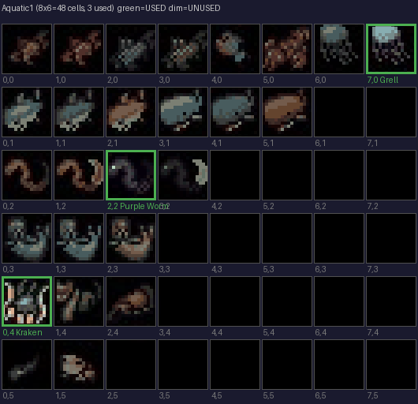

### Avian1

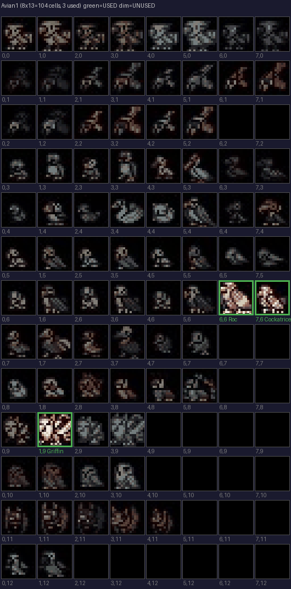

### Cat1

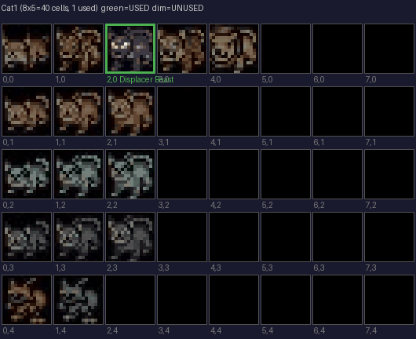

### Compendium

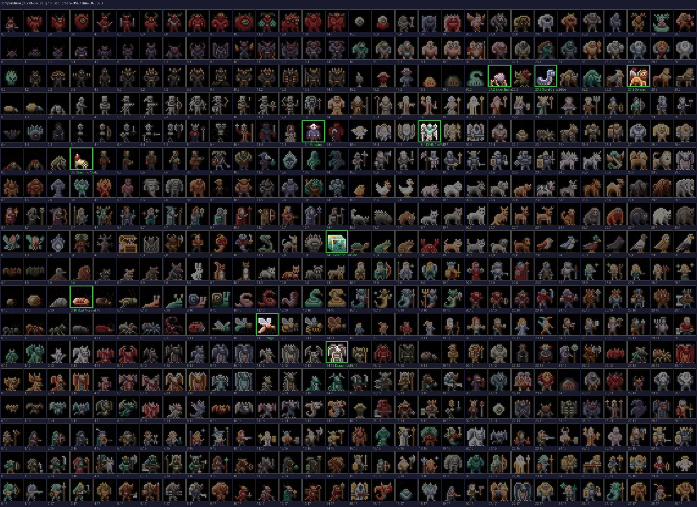

### Demon1

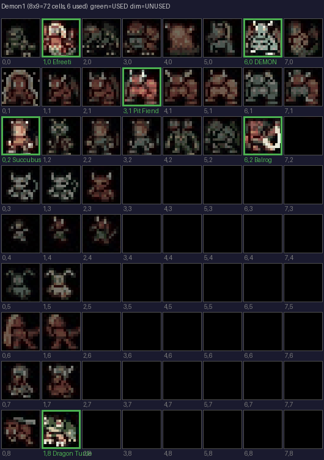

### Dog1

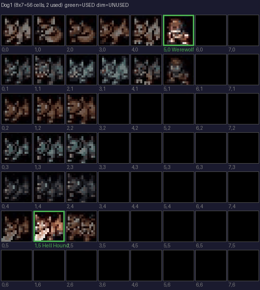

### Elemental1

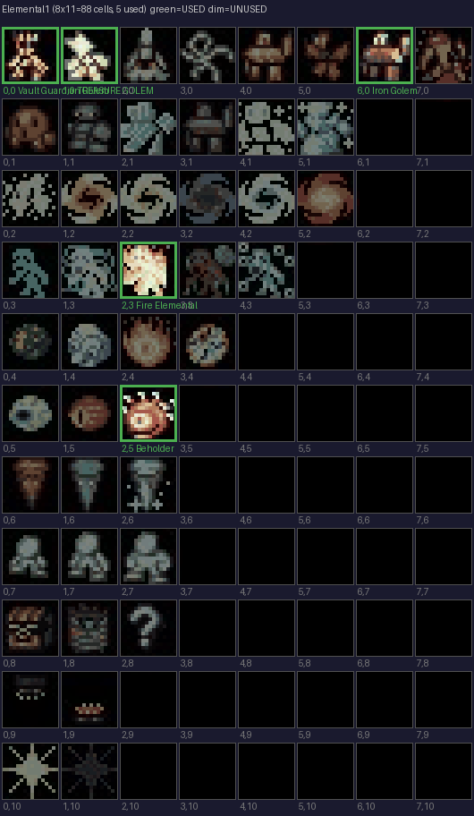

### Humanoid1

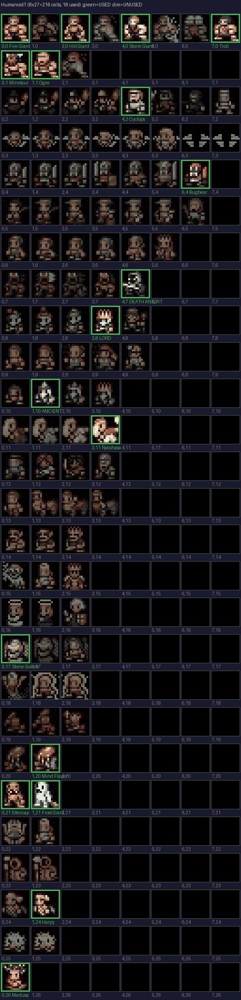

### Misc1

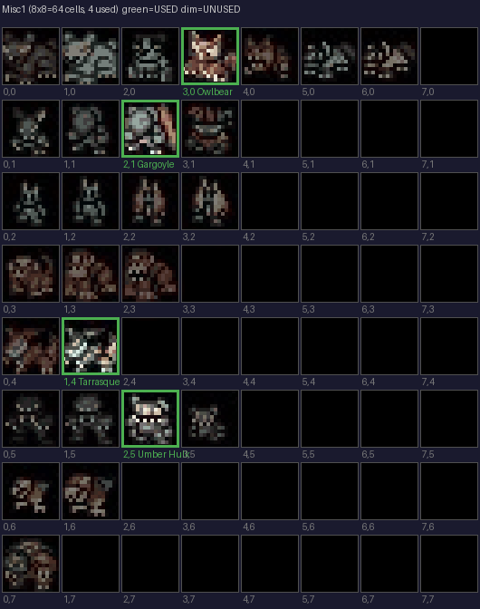

### Pest1

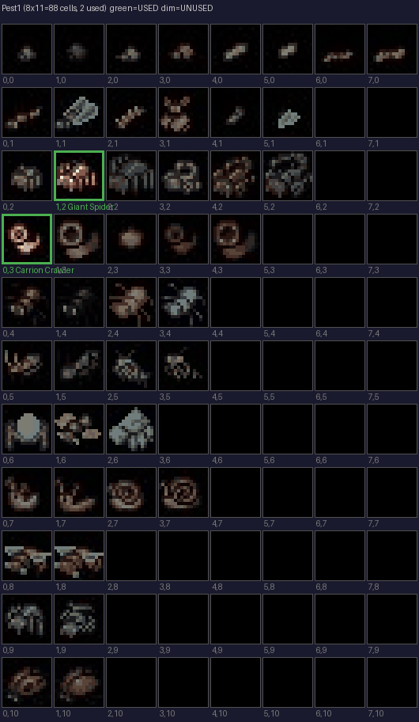

### Plant1

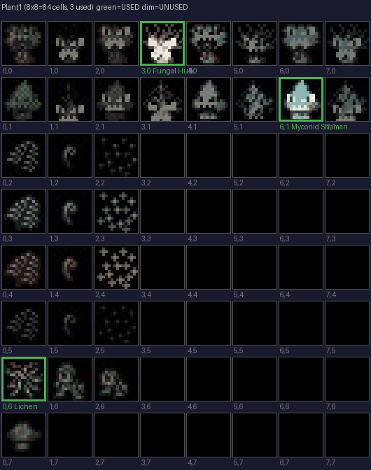

### Quadraped1

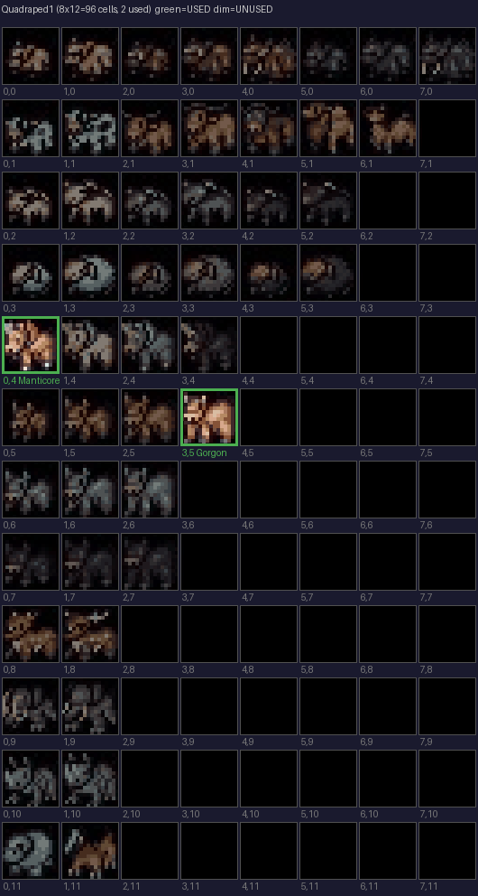

### Reptile1

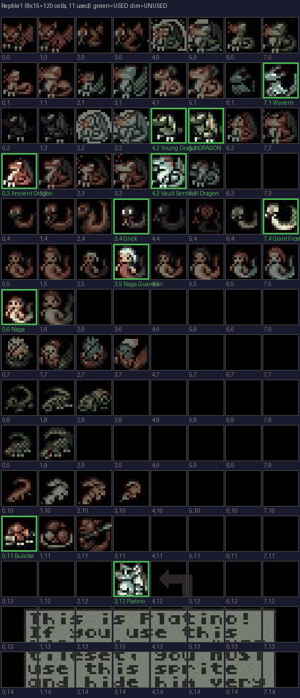

### RogueLike1

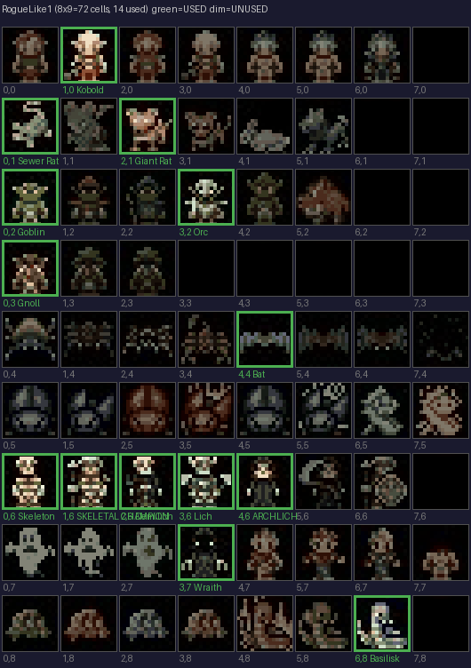

### Slime1

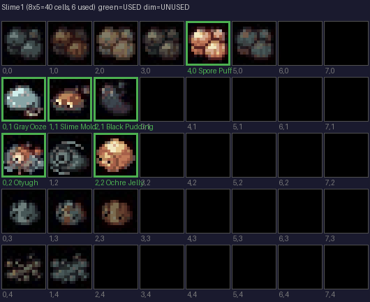

### Undead1

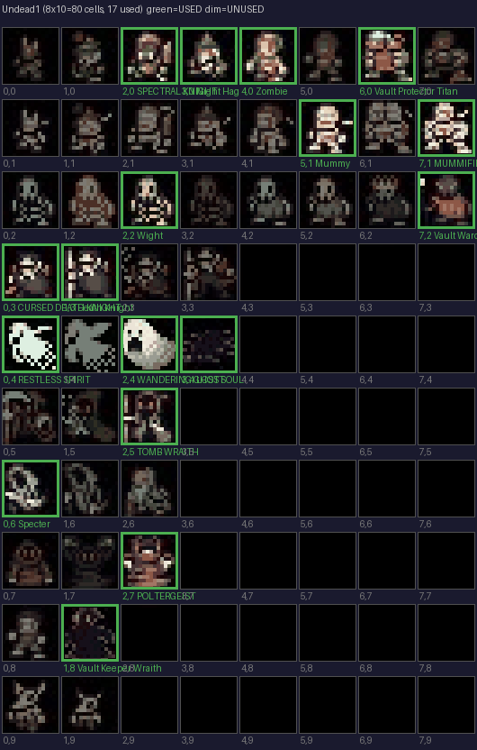

