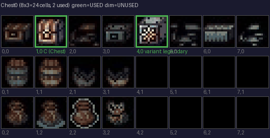
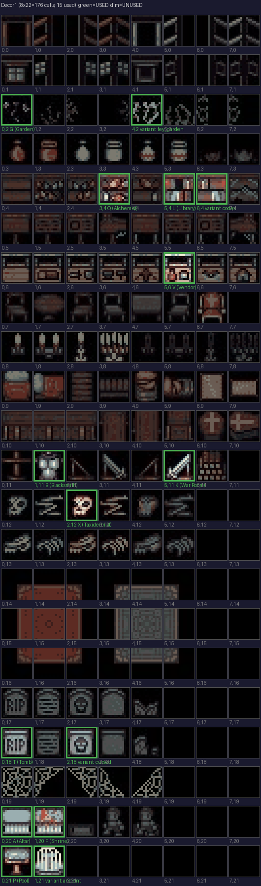
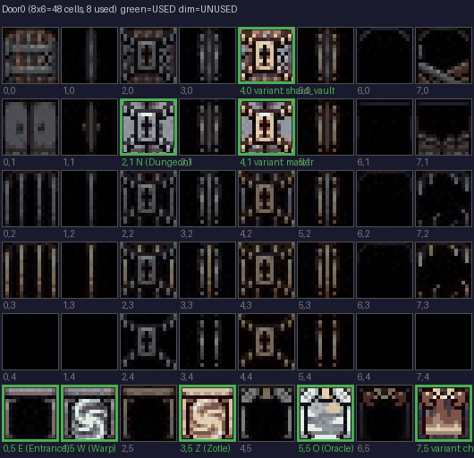
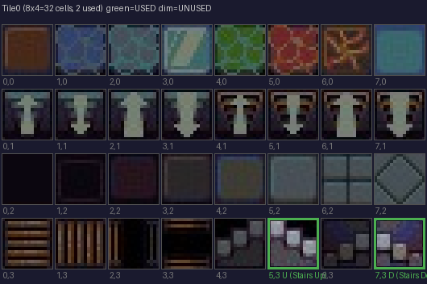

# Room Sprite Assignments

## Summary

| Sheet | Grid | Total | Used | Unused |
|-------|------|-------|------|--------|
| Chest0 | 8x3 | 24 | 2 | 22 |
| Decor1 | 8x22 | 176 | 15 | 161 |
| Door0 | 8x6 | 48 | 8 | 40 |
| Tile0 | 8x4 | 32 | 2 | 30 |

## Assigned Room Sprites

| Room | Sheet | Col,Row |
|------|-------|---------|
| A (Altar) | Decor1 | 0,20 |
| B (Blacksmith) | Decor1 | 1,11 |
| C (Chest) | Chest0 | 1,0 |
| D (Stairs Down) | Tile0 | 7,3 |
| E (Entrance) | Door0 | 0,5 |
| F (Shrine) | Decor1 | 1,20 |
| G (Garden) | Decor1 | 0,2 |
| K (War Room) | Decor1 | 5,11 |
| L (Library) | Decor1 | 5,4 |
| N (Dungeon) | Door0 | 2,1 |
| O (Oracle) | Door0 | 5,5 |
| P (Pool) | Decor1 | 0,21 |
| Q (Alchemist) | Decor1 | 3,4 |
| T (Tomb) | Decor1 | 0,18 |
| U (Stairs Up) | Tile0 | 5,3 |
| V (Vendor) | Decor1 | 5,6 |
| W (Warp) | Door0 | 1,5 |
| X (Taxidermist) | Decor1 | 2,12 |
| Z (Zotle) | Door0 | 3,5 |

### Variants

| Variant | Sheet | Col,Row |
|---------|-------|---------|
| ancient | Decor1 | 1,21 |
| champion | Door0 | 7,5 |
| codex | Decor1 | 6,4 |
| cursed | Decor1 | 2,18 |
| fey_garden | Decor1 | 4,2 |
| legendary | Chest0 | 4,0 |
| master | Door0 | 4,1 |
| shard_vault | Door0 | 4,0 |

## Sprite Sheets

### Chest0

### Decor1

### Door0

### Tile0

