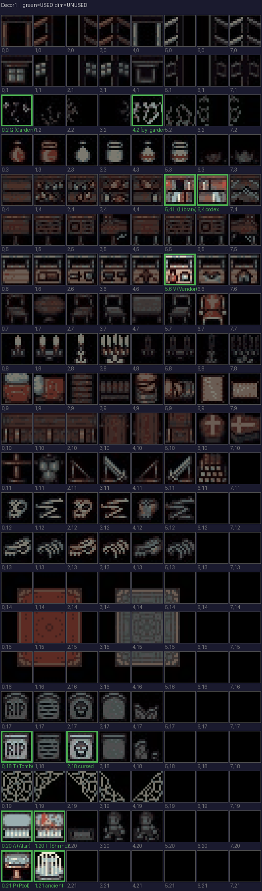
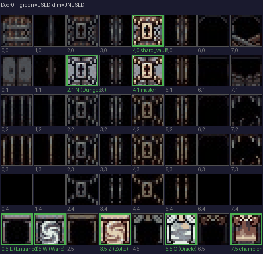

# Sprite Room Assignments

## Missing Room Sprites
These 4 rooms have **no sprite** in their interaction box:
- **B** - Blacksmith (orange)
- **Q** - Alchemist's Lab (green)  
- **K** - War Room (red)
- **X** - Taxidermist (gold)

Pick unused (dim) sprites from the sheets below to assign to these rooms.

---

## Decor1 Sheet (8x22 = 176 cells, 11 used)
Furniture, shrines, plants, decorations — good candidates for room sprites.

---

## Door0 Sheet (8x6 = 48 cells, 8 used)
Doors, portals, gates — good for room entrances.

---

## Currently Assigned Sprites

| Room | Sheet | Col,Row | Notes |
|------|-------|---------|-------|
| A (Altar) | Decor1 | 0,20 | Shrine |
| P (Pool) | Decor1 | 0,21 | Fountain |
| L (Library) | Decor1 | 5,4 | Bookshelf |
| V (Vendor) | Decor1 | 5,6 | Throne/chair |
| T (Tomb) | Decor1 | 0,18 | Skull/bones |
| G (Garden) | Decor1 | 0,2 | Custom sprite |
| F (Shrine) | Decor1 | 1,20 | Memorial |
| W (Warp) | Door0 | 1,5 | Portal swirl |
| N (Dungeon) | Door0 | 2,1 | Locked door |
| O (Oracle) | Door0 | 5,5 | Mystic portal |
| E (Entrance) | Door0 | 0,5 | Portal |
| Z (Zotle) | Door0 | 3,5 | Puzzle portal |

### Variants
| Variant | Sheet | Col,Row |
|---------|-------|---------|
| ancient (Pool) | Decor1 | 1,21 |
| cursed (Tomb) | Decor1 | 2,18 |
| codex (Library) | Decor1 | 6,4 |
| fey_garden | Decor1 | 4,2 |
| master (Dungeon) | Door0 | 4,1 |
| shard_vault | Door0 | 4,0 |
| champion | Door0 | 7,5 |
