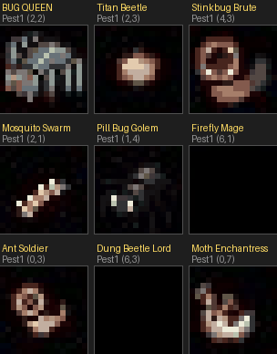
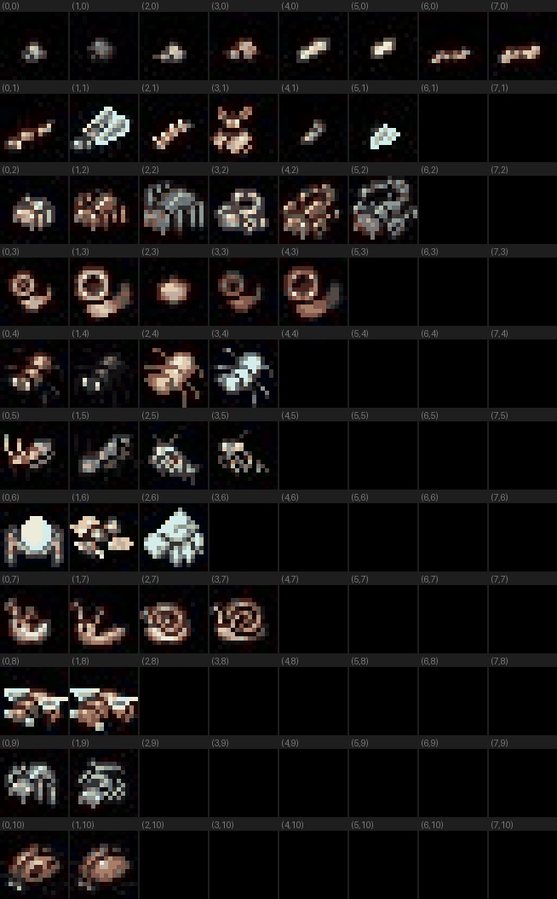

# Bug Monster Sprite Assignments

All bug monsters use the **Pest1** sprite sheet (16x16 pixel cells, 8 columns x 11 rows).

## Current Assignments



| Monster | Sheet | Col | Row | Description |
|---------|-------|-----|-----|-------------|
| **BUG QUEEN** | Pest1 | 2 | 2 | Large menacing spider - the boss |
| **Titan Beetle** | Pest1 | 2 | 3 | Dark heavy beetle/crawler |
| **Stinkbug Brute** | Pest1 | 4 | 3 | Spiky dark beetle |
| **Mosquito Swarm** | Pest1 | 2 | 1 | Flying insect with spread wings |
| **Pill Bug Golem** | Pest1 | 1 | 4 | Armored shell creature (tank) |
| **Firefly Mage** | Pest1 | 6 | 1 | Bright glowing flier |
| **Ant Soldier** | Pest1 | 0 | 3 | Dark beetle/ant |
| **Dung Beetle Lord** | Pest1 | 6 | 3 | Chunky dark beetle |
| **Moth Enchantress** | Pest1 | 0 | 7 | Large winged moth |

## Pest1 Sheet Reference



### Row Guide

| Row | Contents |
|-----|----------|
| 0 | Tiny flies, gnats |
| 1 | Dragonflies, wasps, flying insects |
| 2 | Spiders (various sizes) |
| 3 | Large beetles, centipedes, crawlers |
| 4 | Snails, armored shell creatures |
| 5 | Beetles, crickets, blue/white insects |
| 6 | Scorpions, small centipedes |
| 7 | Moths, butterflies (large wings) |
| 8 | Scorpions, crabs, snails |
| 9 | Caterpillars, worms |
| 10 | Caterpillars, larvae |
| 11 | Large spiders |

## How to Change a Sprite

In `sprite_data.py`, find `generate_monster_sprite_html()` and update the `_MAP` entry:

```python
'Monster Name': ('Pest1', col, row),
```

Coordinates are `(col, row)` matching the reference grid labels above.
